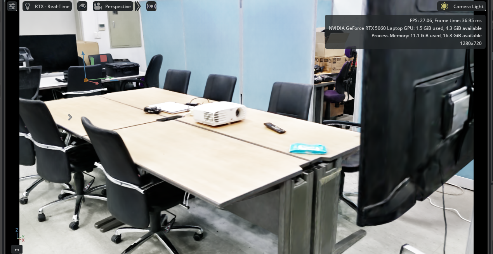

# DT_RCcar — Isaac Sim Limo Nav2 Digital Twin

Isaac Sim 안에 스캔한 사무실 맵(Gaussian Splat) 위에 AgileX Limo(4륜 스키드조향 차동구동) 로봇을 배치해서:

맵 원본은 **XGRIDS K2** 장비로 사무실을 스캔해서 얻은 Gaussian Splat 재구성 결과(`usd/lcc-usdz-result/mesh-model.usdz`)입니다.



1. **WASD 키보드 텔레옵**으로 수동 조작
2. **RViz에서 클릭한 목표 지점까지 Nav2 자율주행**

둘 다 구현 완료 (2026-09-07).

## 저장소 구조

```
0907.usd                          # 메인 스테이지 (맵 + Limo 로봇)
usd/                              # 맵 메시 원본 — 0907.usd가 상대경로로 참조
├── lcc-usdz-result/              # ⚠️ *.usdz는 100MB+라 이 repo엔 없음(.gitignore) — 별도로 옮길 것
└── mesh-files/
limo_wasd_teleop_behavior.py      # WASD 전용 텔레옵 BehaviorScript
limo_nav2_behavior.py             # 현재 /limo에 부착된 스크립트 — WASD+Nav2 겸용
prepare_nav2_assets_limo.py       # occupancy map 생성 + 라이다 부착용 1회 실행 스크립트 (headless)
nav2/
├── limo_map.png / limo_map.yaml  # 생성된 occupancy map
├── nav2_params_limo.yaml         # Nav2 파라미터 (Limo 크기에 맞게 튜닝됨)
├── limo_navigation.launch.py     # Nav2 브링업 launch 파일
└── limo_view.rviz                # RViz 설정
run_isaac.sh / run_nav2.sh / run_rviz.sh   # 실행 스크립트
```

## 필요 환경

- Isaac Sim 5.1
- ROS2 Humble + Nav2 (`ros-humble-navigation2`, `ros-humble-nav2-bringup`)
- 인터넷 연결 (`/limo`, `/limo/lidar`가 NVIDIA 서버의 https:// 에셋을 직접 참조)

## 맵 메시 원본 (git repo가 아니라 Release로 받아야 함)

`0907.usd`가 실제로 참조/사용하는 맵 메시는 `usd/lcc-usdz-result/mesh-model.usdz` **하나뿐**입니다
(같은 폴더의 `model.usdz`는 어디서도 참조되지 않는 미사용 파일이라 안 받아도 됩니다).

**촬영 장비**: **XGRIDS K2**로 사무실을 스캔한 뒤 Gaussian Splat으로 재구성한 결과물입니다. 바닥이 완전히 평탄하지 않은 등 재구성 노이즈가 있어서, 이 프로젝트의 occupancy map 생성 파라미터(`prepare_nav2_assets_limo.py`)와 벽 충돌 판별 임계값(`limo_nav2_behavior.py`)이 이 노이즈를 감안해서 튜닝되어 있습니다 — 다른 맵으로 교체 시 재검증이 필요합니다.

일반 git 커밋에는 파일 크기 제한(100MB)에 걸려서 못 넣었고, 대신 **GitHub Release**로 올려뒀습니다:

👉 **[map-assets-v1 릴리즈에서 mesh-model.usdz 다운로드](https://github.com/jeonsy7883/DT_RCcar/releases/tag/map-assets-v1)**

받은 파일을 clone한 저장소의 `usd/lcc-usdz-result/mesh-model.usdz` 경로에 그대로 넣으면 됩니다.

```bash
gh release download map-assets-v1 --repo jeonsy7883/DT_RCcar -D usd/lcc-usdz-result/
```

## 하드코딩된 경로 (다른 PC에서 실행 시 수정 필요)

`run_isaac.sh`, `run_nav2.sh`, `run_rviz.sh`, `prepare_nav2_assets_limo.py` 안에 이 PC 기준 절대경로(`/home/jeon/...`)가 박혀있습니다. 다른 환경에서 쓰려면 Isaac Sim 설치 경로와 이 프로젝트 경로에 맞게 고쳐야 합니다.

## 실행 순서

```bash
./run_isaac.sh     # Isaac Sim 실행 → Play (스크립트 실행 허용 팝업 뜨면 Yes)
./run_nav2.sh       # 별도 터미널
./run_rviz.sh       # 별도 터미널
```
RViz에서 "Set Goal" 도구로 지도 위 목표 지점 클릭 → Limo 자율주행.

## 실물 RC카(라즈베리파이) 연동

시뮬레이션과는 별개로, 실물 RC카(라즈베리파이 기반)와 연동해서 두 가지를 구현했습니다 (2026-09-11 기준):

1. **카메라 스트리밍**: 실물 RC카에 달린 카메라 영상을 RViz(`RCCarCamera`, `limo_view.rviz`에 등록됨)로 실시간 확인
2. **벽 충돌 → 실물 부저**: Isaac Sim 안에서 Limo가 벽에 부딪히면(PhysX contact report로 감지), 실물 RC카의 부저가 짧게(기본 0.2초, duty 5%) 울림

### 실행 방법 (라즈베리파이 쪽)

카메라 + 부저 노드를 한 번에 띄우는 launch 파일을 `raspberrypi/rc_car_sensors.launch.py`에 참고용으로 포함해뒀습니다 (실제로는 라즈베리파이 `~/rc_car_sensors.launch.py`에 배포되어 있음). 라즈베리파이에 SSH 접속 후:

```bash
ros2 launch ~/rc_car_sensors.launch.py
```

라즈베리파이 `~/.bashrc`에 `ROS_DOMAIN_ID=0`, `RMW_IMPLEMENTATION=rmw_fastrtps_cpp`, ROS2 워크스페이스 source가 이미 등록되어 있어서 SSH 접속만 하면 바로 실행 가능합니다. 데스크탑(Isaac Sim)과 라즈베리파이는 같은 `ROS_DOMAIN_ID`를 써야 서로 통신됩니다.

### 부저 트리거 조정

`limo_nav2_behavior.py` 상단 상수로 조정 가능:
- `_BUZZER_DUTY_ON` (기본 5.0): 부저 소리 크기(duty %)
- `_BUZZER_ON_DURATION_SEC` (기본 0.2): 울리는 시간(초)
- `_WALL_CONTACT_NORMAL_Z_THRESHOLD` (기본 0.3), `_WALL_CONTACT_IMPULSE_THRESHOLD` (기본 1.0): 벽 충돌 오탐/미탐 조정용 — 맵이나 로봇이 바뀌면 재검증 필요 (실측 방법은 코드 주석 참고)

### ⚠️ 알려진 하드웨어 제약

- **구동 모터·서보모터는 사용 불가**: I2C(주소 `0x16`)로 모터 드라이버(STM8 확장보드)에 명령을 보내도 응답이 없음. 라즈베리파이의 모든 I2C 버스(0/1/10/22)를 스캔해도 장치가 안 잡히고, 재부팅 후에도 동일 — STM8 펌웨어가 먹통(브릭)이 된 것으로 추정. 케이블/전원은 육안 확인상 정상. 전원 인가 시 모터가 짧게 도는 현상은 있어 하드웨어 자체가 완전히 죽은 건 아니나, 정상적인 I2C 명령 처리는 안 됨. `cmd_vel_to_motor` ROS2 노드(`rccar_driver` 패키지)는 코드상으로는 존재하지만 지금은 실행해도 무의미함.
- **초음파 거리 센서(HC-SR04, GPIO 16/18번)는 정상 작동 확인됨**(모터와 달리 I2C가 아닌 GPIO 직결이라 무관)하지만, 아직 ROS2 노드로 연동되어 있지 않음 — 라즈베리파이의 `~/self_driving_car/4_ultrasonic_test.py` 독립 스크립트로만 확인된 상태.

## 겪은 문제와 해결 (트러블슈팅 참고용)

1. **BehaviorScript(`omni:scripting:scripts`)가 조용히 로드 안 됨**: 속성만으론 부족하고, 프림에 `OmniScriptingAPI` 싱글-apply 스키마가 **함께** apiSchemas에 있어야 하고, 속성 variability가 반드시 **uniform**이어야 함 (`uniform asset[] omni:scripting:scripts`). 둘 중 하나라도 안 맞으면 에러 로그도 없이 조용히 무시됨.
2. **RTX Lidar 생성 커맨드 함정**: `omni.kit.commands.execute("IsaacSensorCreateRtxLidar", path="/limo/lidar", parent=None, ...)`처럼 절대경로+`parent=None`을 주면 엉뚱한 위치(`/World/limo/lidar_02`)에 생성됨. `path="lidar", parent="/limo"` 형태로 분리해서 호출해야 함.
3. **occupancy map 노이즈**: 이 씬의 콜리전 메시(Gaussian Splat 재구성)는 바닥이 world z=0.0이 아니라 z≈-0.89. 바닥 바로 위(2~70cm) 밴드로 스캔하면 실내 전체가 OCCUPIED로 나옴. 실측 비교 결과 "바닥 위 0.8m~2.0m" 밴드가 가장 결과가 좋았음.
4. **GPU VRAM 8GB 제약**: headless map 생성 스크립트를 Isaac Sim GUI와 동시 실행하면 크래시 위험 — GUI 먼저 닫고 실행할 것.
5. **RViz "Lookup would require extrapolation into the future" 경고**: `/scan`(Isaac Sim 렌더 시각)과 `/tf`(behavior script가 물리 스텝 누적한 시각)가 다른 시간 소스라 나는 경고. 동작엔 지장 없음.
6. **PhysxContactReportAPI는 PhysX가 씬을 파싱하기 전(스테이지 로드 시점 = `on_init()`)에 프림에 붙어야 함**: Play 이후(`_setup_impl`)에 붙이면 Kit이 이미 물리 씬을 파싱한 뒤라 콜백이 아예 호출되지 않음(접촉 이벤트 0건, 실측 확인). Isaac Sim 공식 `ContactReportDemo`도 씬 생성 시점에 붙이는 패턴.
7. **평지 주행 중 바퀴 접촉의 `normal_z`만으로는 벽 충돌 판별 불가**: Gaussian Splat 재구성 메시라 바닥이 울퉁불퉁해서 평지 주행 중에도 `normal_z`가 0.17까지 낮게 나올 수 있음. 접촉 impulse의 수평 성분 크기(`horiz_impulse`)를 함께 요구해서 오탐 방지(자세한 임계값은 `limo_nav2_behavior.py` 코드 주석 참고).
8. **SSH 원격 명령에서 `pkill -f <패턴>` 사용 시 자기 자신을 죽이는 함정**: 그 패턴 문자열이 원격 쉘 스크립트 자기 자신의 커맨드라인에도 포함되어 있으면(예: 스크립트 안에서 같은 문자열을 echo하거나 명령어로 쓴 경우) `pkill -f`가 자기 자신의 `bash -c` 프로세스를 매치해서 SSH 세션이 그 자리에서 끊김(exit 255). PID(`$!`)로 특정해서 끄거나, launch 파일로 묶어서 `Ctrl+C`로 종료하는 걸 권장.
